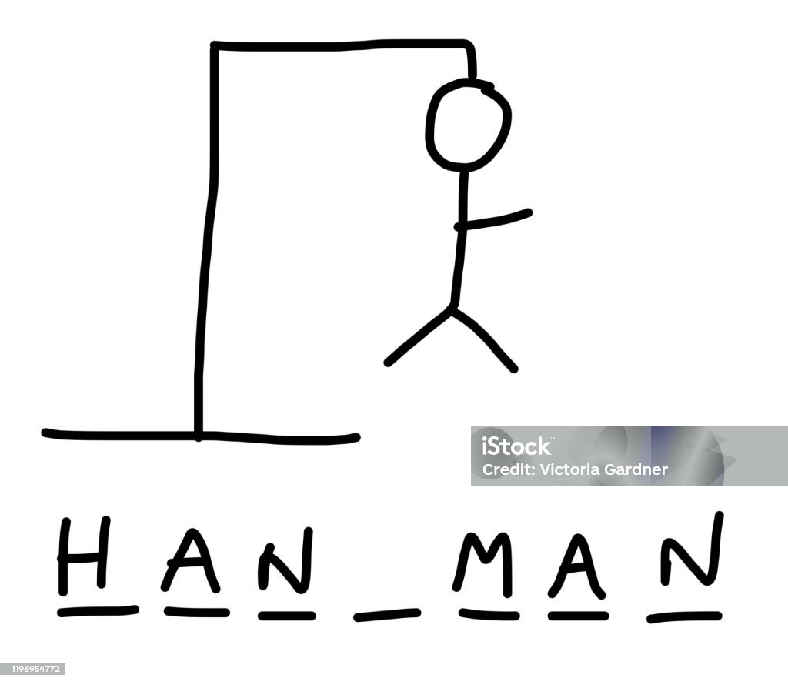
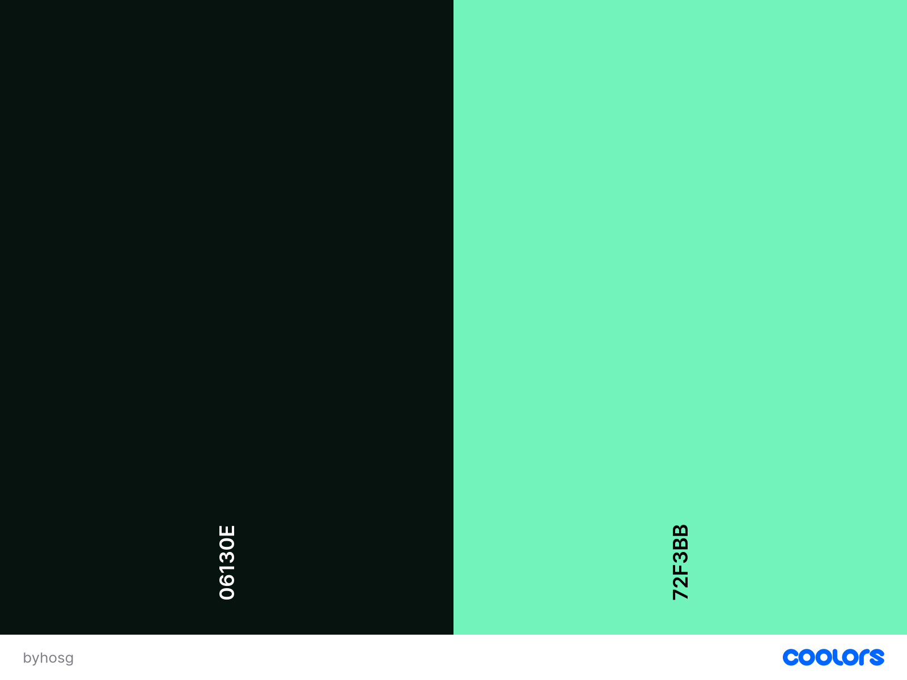

# Build Your House On Solid Ground-Game 

## Description

“Build Your House on Solid Ground-Game” is leaned on the popular hangman game. But instead of a man get hung up when maximum attempts are used, the player needs to guess the word right to prevent the house from collapsing.


You can visit the live website [here!]( )

## Game Rules

The Build Your House on Solid Ground-Game is a game that tests the players´ bible-knowledge by guessing the word from a chosen category right. Here’s how to play:

**Starting the Game:**
   - In order to start the game, the user needs to type in a wanted letter in the input field. When the page is restarted a random word will be caught from the wordlist.

**Guessing the Word:**
   -  By typing in the right letter, the searched word will be visible by each right guesses.

**Continuing the Game:**
   - The user can click on "Cancel" to restart the game or by refreshing the page.

**Winning the Game:**
   - The player wins the game by successfully entering the right letter within the given maximum attempts.

**Game Over:**
   - If the player enters the wrong letter six times and has not guessed the word right. A picture of a collapsed house will be shown. Thus he/she fails to build the house on solid ground (This feature unfortunately doesn´t work properly.)
   - The player can restart the game by pressing the "Cancel" button or refresh the page.

**Additional Features (to be included in the future ):**
      - **Score tracker:** User can track their scores and see their progress.

Test Your Bible knowledge and play the game!


## History of the Hangman Game

The Hangman game was originated from 17th century Europe and was first introduced as “Rite of Words and Life.” This was played or rather was demanded by prisoners facing death penalty. Due to its dark beginnings, the game has been modified in a variety of ways to appear more kid friendly. In this case the game was adjusted to be “Build your House on Solid Ground-Game”. Until this day the hangman game still is one of the popular classroom, paper and pencil guessing game.

#### **How It Works**

Blank line spaces of a particular word are presented by the host. The player/s then guess the word by calling out letter by letter. The right guesses will be revealed and the blanks replaced by the letter. With each wrong guess, however a drawing of a hangman comes together line by line or body part by body part. The game ends either by guessing the word right or by a complete drawing of the hangman, which means that game is lost.

#### **Benefits**

It is said that playing hangman will extend the existing vocabulary knowledge and spelling. It enhances cognitive skills and improves analytical thinking as the player must think of a strategy of calling out specific letters in a certain order. Moreover, it is a wonderful source of entertainment.


## **User Experience**

#### **Project Goals**

1. **Provide an engaging and interactive game that challenges the Bible knowledge of the player.**
2. **Offer a visually appealing and responsive design suitable for both desktop and mobile users.**
3.  **Ensure an uninterrupted and user-friendly user interface.**

### **User expectations**

- Website is easy to access from any devices

- Website works on all devices in terms of appearance

- User-friendly interface where the user can get around using the webpage effortlessly

- Links and features that work the way they should

- Simple layout

- Get help in the game by getting hints

-Abort and restart the game anytime

-Get feedback about the typed letter

-Track progress and see how many attempts left

### **User stories**

#### **User**

- As a younger or an older user, I want a simple, beginner-friendly interface that allows me to straightforwardly play the game.

- As a believer, I want to test my bible knowledge and have fun in a biblical way.

### **Target Audience**

- Users wanting to test their Bible knowledge for fun.
- Individuals seeking to improve their Bible knowledge.
- User looking for a simple and fun game to play.

#### **Demographic:**
-	User aged between 6 and 90+ years

## **Design**

#### **Colours**

Colors were generated by [coolors](https://coolors.co/)


#### **Typography**

- All icons were sourced through [Font Awesome](https://fontawesome.com/)
- All fonts were sourced through [Google Fonts](https://fonts.google.com/)
- [Press Start 2P](https://fonts.google.com/specimen/Press+Start+2P)


#### **Wireframe and Prototype**

##### [Balsamiq](https://balsamiq.com/) wireframe:

<details>
<summary> Open for desktop wireframe </summary>


</details>

<details>
<summary> Open for mobile wireframe </summary>


</details>
<details>
<summary> Open for tablet wireframe </summary>


</details>


## Features

#### **Meta Tags and Optimization**

The <head> section of the Build your House on Solid Ground-Game website includes essential meta tags for SEO and social media sharing. The meta description provides a summary for search engines, while the keywords tag helps search engines understand the site content. 

#### **Game website**

The Home page serves as the main entry and exit point for the application, as it consists of only one page. It features a "Check Answer" button to start the Game and check their answer and a "Restart" button that refresh the game. The layout and style and style of the game is kept simple user can click on the "Instruction" link to get help playing the game. At the beginning users are welcomed by an alert box before the system get a random word from a list to be guessed. The user can see the house in sunny weather.

| Desktop                                                                           | Mobile                                                                          |
| --------------------------------------------------------------------------------- | ------------------------------------------------------------------------------- |
|  |  |

#### **Game Area**

The Game area is where the actual game takes place. It includes house-container, the searched word container and displays to the user their maximum number of attempts and how many they have used as well as the already used letter.

| Desktop                                                                           | Mobile                                                                          |
| --------------------------------------------------------------------------------- | ------------------------------------------------------------------------------- |
|  |  |
| Desktop | Mobile |
|-------------------|-------------------|
|||
| Desktop | Mobile |
|-------------------|-------------------|
|||
| Desktop | Mobile |
|-------------------|-------------------|
|||
|||

| Desktop | Mobile |
|-------------------|-------------------|
|||


### **Footer Section**

The "Footer" section is indicated that the website is created for educational purposes with icons linked to the developer GitHub and LinkIn profile.
| Desktop | Mobile |
|-------------------|-------------------|
|||

## BEM Methodology

BEM (Block, Element, Modifier) is a popular naming convention for classes in HTML and CSS, originally developed by Yandex. It is designed to create reusable, modular, and maintainable code.

#### BEM Structure

BEM divides the user interface into independent blocks, which can be reused across different parts of the application. The naming convention follows a specific structure:

- **Block**: The top-level component or a standalone entity that is meaningful on its own.
  - Example: `header`, `container`, `menu`
- **Element**: A part of a block that performs a certain function and has no standalone meaning.
  - Example: `header__title`, `menu__item`
- **Modifier**: A flag on a block or an element that changes its appearance or behavior.
  - Example: `menu__item--active`, `header--large`

#### Naming Convention

The BEM naming convention uses a double underscore (`__`) to separate elements from their block and a double hyphen (`--`) to separate modifiers from blocks or elements.

- **Block**: `block-name`
- **Element**: `block-name__element-name`
- **Modifier**: `block-name--modifier-name` or `block-name__element-name--modifier-name`

#### Example

```html
<div class="menu">
  <ul class="menu__list">
    <li class="menu__item menu__item--active">Home</li>
    <li class="menu__item">About</li>
    <li class="menu__item">Contact</li>
  </ul>
</div>
```

In this example:

- `menu` is the block.
- `menu__list` and `menu__item` are elements of the menu block.
- `menu__item--active` is a modifier that changes the appearance of the `menu__item` element.

#### Benefits of BEM

1. **Clarity and Readability:** BEM makes it clear what each class refers to by looking at its name. It is easy to identify whether a class represents a block, an element, or a modifier.

2. **Modularity:** BEM promotes the creation of independent components. Each block is standalone, making it easier to reuse and maintain.

3. **Avoids Naming Conflicts:** The structured naming convention helps avoid class name conflicts, which are common in larger projects with many contributors.

4. **Improved Maintainability:** With BEM, the CSS and HTML structure is more organized, making it easier to understand, debug, and modify the code.

5. **Enhanced Scalability**: BEM's approach is particularly useful for large projects as it provides a consistent methodology for naming and structuring classes.

6. **Better Collaboration:** The clarity and structure provided by BEM make it easier for multiple developers to work on the same project without confusion.
## Naming Convention in this case

The naming convention of this project uses name related to the website content such as in the example below. Showing the argument section using the purpose of the specific sections.


## Testing

Responsiveness has been checked and adjusted in Chrome Dev Tools and the site has been viewed on mobiles and desktop without issues and the following browsers:

- Chrome

- Safari

- Edge

#### **JSHint Validation**

The JavaScript code has been run through the [JS Hint](https://jshint.com/) validator. Results can be found below.


#### **HTML Validation**

The HTML code has been run through the [W3C - HTML](https://validator.w3.org/) validator. Results can be found below.


#### **CSS Validation**

The CSS code has been run through the [W3C - CSS](https://jigsaw.w3.org/css-validator/) validator. Results can be found below.


#### **Google Lighthouse**

The lighthouse score results can be found below.


#### **WAVE Accessibility Evaluation**

The WAVE accessibility evaluation tool results can be found below.


#### **Manual Testing**

| Features                   | Expected Outcome                                                            | Test Performed                                             | Results                                                                                      | Pass/Fail |
| -------------------------- | --------------------------------------------------------------------------- | ---------------------------------------------------------- | -------------------------------------------------------------------------------------------- | --------- |
| **Home/Game Screen**            |
| Check Answer Button                | Check the input                                                | Clicked "Check Answer" button                                      | Successfully checking the letter and give feedback by alert oder by displaying                                                    |:white_check_mark:
| Hints Check Button               | open and close hints                                            | Clicked "hints" button                                     | Successfully open and close hints                                                  | :white_check_mark:
| **attempt count**           |
| Cancel Button               | Reset game                                                 | Clicked "Cancel" button                                     | Successfully reset game and catch new random word                                               | :white_check_mark:
| **Game Area**            |
| display currentWord in "_ "              | display word in arrays of "_"                                | refresh page                                | currentWord show in "_ "                                            | :white_check_mark:
| winning alert box              | When the word is guessed, alert box should show up                                     | win the game                                   | alert box show up                                               |:white_check_mark:
|  loss alert box              | When word is not guessed within the maxium attempts, alert box should show up                                        | lose the game                                    | alert box show up                                           | :white_check_mark:
| **Footer**                 
| Footer Link to GitHub and LinkIn     | The footer contains a link that opens the GitHub repository and LinkIn in a new tab.   | Check the footer section of the page and inspect the link. | The link is present and correctly opens in a new tab.                                        | :white_check_mark:

### **Bugs**

### 1.

**Description:**  
When guessed right once and guessed wrong the other time, attemptsCount doesn´t increment, but stay still.


**Expected Behavior:**
That attemptsCount add up and thus the image change.

**Actual Behavior:**
Increment stops to work and thus image does not change accordingly.

**Solution:**
No solution
<details>
<summary> Click to see images </summary>


</details>

#### **Test Final Review**

The testing procedures have been executed, meeting certain criteria apart from some bugs, that I couldn´t get it fixed due to lack of time. Results have been documented, and any identified issues have been addressed. Post-testing, the website has been confirmed to be fully functional and accessible.

## Tech Stack

This website is developed using the following technologies:

**HTML**: For structuring the content and layout of the web pages.

**CSS**: For styling the website and making it visually appealing.

**JavaScript**: For adding interactivity and dynamic features to the website.

## Tools Used

This website is developed using the following tools:

**GitHub**: Used for version control and code storage. GitHub allows for collaborative development, issue tracking, and code review, ensuring a smooth workflow and version management.

**Gitpod**: Cloud-based workspace environment where developers can code, write and debug without any local setup.

**Google DevTools**: A set of web developer tools built directly into the Google Chrome browser. Google DevTools provides features for debugging, editing CSS and HTML on the fly, and analyzing website performance.

**Google Fonts**: A library of over a thousand free and open-source font families. Google Fonts ensures consistent and aesthetically pleasing typography across different browsers and devices.

**Font Awesome**: A toolkit for using icons and social logos on your website. Font Awesome icons are vector-based, which makes them highly customizable in terms of size, color, and positioning.

**gauger.io/fonticon/**: A tool to make favicons out of fonticonts.

**W3C Markup Validation Service**: A tool provided by the World Wide Web Consortium (W3C) to validate HTML and XHTML documents. This service checks for errors in the markup to ensure compliance with web standards.

**W3C CSS Validation Service**: A tool provided by W3C to validate CSS code. It helps in identifying errors and potential issues in the stylesheet, ensuring it adheres to CSS standards.

**WAVE Accessibility**: A web accessibility evaluation tool. WAVE helps in identifying accessibility issues on web pages, ensuring they are accessible to users with disabilities.

**Google Lighthouse**: An open-source, automated tool for improving the quality of web pages. Lighthouse audits performance, accessibility, SEO, and other best practices, providing insights and recommendations for improvement.

**Balsamiq**: A wireframing tool used to create low-fidelity mockups. Balsamiq helps in quickly visualizing the structure and layout of web pages before moving on to high-fidelity design.

**JSHint:** A static code analysis tool used to detect errors and potential problems in JavaScript code. JSHint helps ensure code quality and adherence to best practices.

**Beautify**: A code formatter that enforces a consistent style by parsing your code and re-printing it with its rules. Prettier helps maintain clean and readable code throughout the project.

**Am I Responsive** An online tool to create mockups.

**Canva** To edit the colors of the pictures.

**patorjk** To create the Logo and instruction in ASCII Code style

Each of these tools are vital to the coding process, deployment and maintenance of the project.

## Deployment

_This website is deployed using Git Pages_

#### Steps

1. **Log in to Git Hub:** Navigate to the [Github website](https://github.com/) and log in to your account.
2. **Go to your repository:** Once logged in, the dashboard will appear and on the left-hand side there are your top repository.
3. **Select Repository:** Select the repository for website to be deployed, in this case, "twtttl-church"
4. **Go to the Settings tab:** Click on the setting tab and a new interface will open
5. **Select Pages:** On the left-hand side you will find 'Pages' nested in the Code and automation section, 
6. **Configure Settings:** 'Source' needs to be set to `Deploy from Branch’ the 'Main branch' should be selected and the folder needs to be set to '/root'
7. **Deploy website:** By clicking 'Save' under the branch, your website will be deployed.
8. **Refresh Repository:** Return to the Code tab. After a few minutes you can refresh your repository.
9. **View the deployment:** Go to ´github-pages’ on the right-hand side and see your deployment.
10.**Live Site:** After the deployment process is complete, GitHub will provide you with a unique URL consisting of your username and the name of your project for your live site. 
You can access my live site by visiting this URL.[Live website]( https://tanja-franke.github.io/BYHOSG_CI_PP3/)

## Credits
The JS code were taken and individually adapted from Youtube tutorial by [@Great Day Designs](https://youtu.be/EJ3GeUDGLE4?feature=shared) and from an anonymous user from [GeeksforGeeks]( https://www.geeksforgeeks.org/word-guessing-game-using-html-css-and-javascript/). For a better understanding of javaScript I refer back to the CI lessons and to an eBook from [No Starch Press, JavaScript for Kids](https://nostarch.com/download/JS4K_ch7.pdf).
Readme template was taken from CI_template and from [@Tulio Minini](https://github.com/t-minini) and adapted accordingly 
All images used in this project are credited to their respective authors. You can find the authors´ information below. 
Credits to: freepiks.com @ Konkapp, @ pojok d, @ Iconjam


## Acknowledgements

My CI facilitator Kamil Wojciechowski and my peers from 5p for motivating, helping and giving me feedback and reviewing my work!
The Stack Overflow community for providing answers to specific coding questions.

